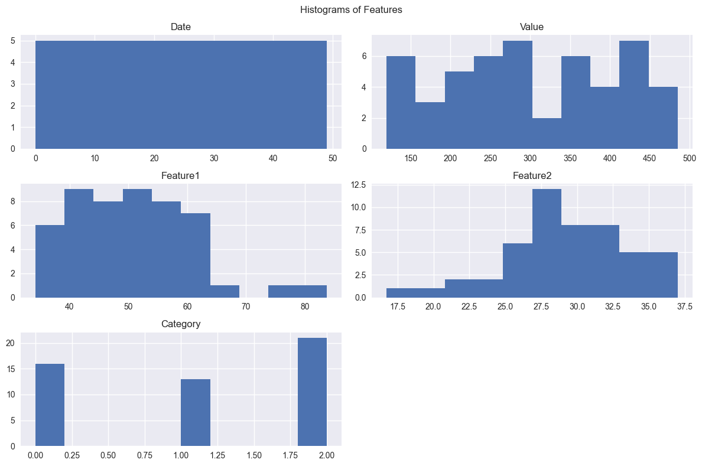
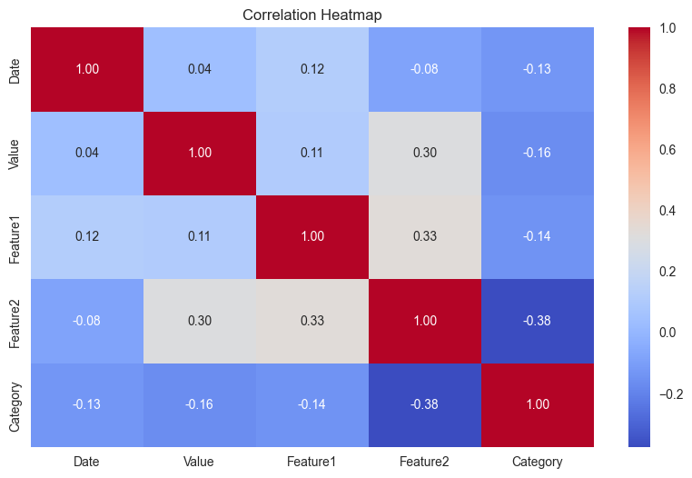
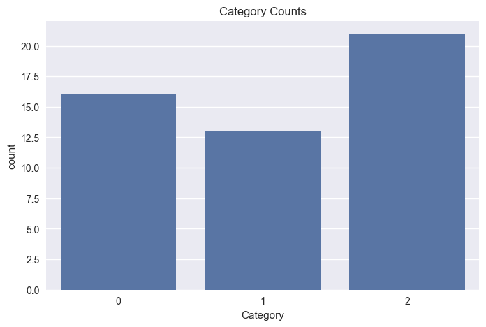

```python
import pandas as pd
import numpy as np
import matplotlib.pyplot as plt
import seaborn as sns
import os
from sklearn.preprocessing import LabelEncoder

# -------------------------------
# Step 1: Load Dataset
# -------------------------------
df = pd.read_csv("data_visualizer_dataset.csv")
print("✅ Dataset loaded successfully!")
print(df.head(), "\n")

# -------------------------------
# Step 2: Basic Info
# -------------------------------
print("📌 Dataset Shape:", df.shape)
print("\n📌 Dataset Info:")
print(df.info())
print("\n📌 Missing Values:\n", df.isnull().sum())
print("\n📌 Summary Statistics:\n", df.describe())

# -------------------------------
# Step 3: Handle Missing Values
# -------------------------------
df.ffill(inplace=True)
print("\n✅ Missing values handled!")

# -------------------------------
# Step 4: Encode Categorical Columns
# -------------------------------
le = LabelEncoder()
for col in df.select_dtypes(include="object").columns:
    df[col] = le.fit_transform(df[col])
print("\n✅ Categorical columns encoded!")

# -------------------------------
# Step 5: Correlation Matrix
# -------------------------------
corr = df.corr()
print("\n📌 Correlation Matrix:\n", corr)

# -------------------------------
# Step 6: Visualization Setup
# -------------------------------
plt.style.use("seaborn-v0_8")   # ✅ Fixed style issue
os.makedirs("plots", exist_ok=True)

# -------------------------------
# Step 7: Histograms
# -------------------------------
df.hist(figsize=(12, 8))
plt.suptitle("Histograms of Features")
plt.tight_layout()
plt.savefig("plots/histograms.png")
plt.show()
print("📊 Histogram saved: plots/histograms.png")

# -------------------------------
# Step 8: Correlation Heatmap
# -------------------------------
plt.figure(figsize=(10, 6))
sns.heatmap(corr, annot=True, cmap="coolwarm", fmt=".2f")
plt.title("Correlation Heatmap")
plt.savefig("plots/correlation_heatmap.png")
plt.show()
print("📊 Heatmap saved: plots/correlation_heatmap.png")

# -------------------------------
# Step 9: Category Counts
# -------------------------------
if "Category" in df.columns:
    plt.figure(figsize=(8, 5))
    sns.countplot(x="Category", data=df)
    plt.title("Category Counts")
    plt.savefig("plots/category_counts.png")
    plt.show()
    print("📊 Category counts saved: plots/category_counts.png")

print("\n✅ All analysis complete! Check the 'plots/' folder for results.")

```

    ✅ Dataset loaded successfully!
             Date  Value   Feature1   Feature2 Category
    0  2023-01-01    202  43.997461  34.517662        B
    1  2023-01-02    448  59.474398  30.095002        B
    2  2023-01-03    370  52.910340  27.327918        B
    3  2023-01-04    206  43.644403  22.524731        C
    4  2023-01-05    171  39.784478  26.053708        C 
    
    📌 Dataset Shape: (50, 5)
    
    📌 Dataset Info:
    <class 'pandas.core.frame.DataFrame'>
    RangeIndex: 50 entries, 0 to 49
    Data columns (total 5 columns):
     #   Column    Non-Null Count  Dtype  
    ---  ------    --------------  -----  
     0   Date      50 non-null     object 
     1   Value     50 non-null     int64  
     2   Feature1  50 non-null     float64
     3   Feature2  50 non-null     float64
     4   Category  50 non-null     object 
    dtypes: float64(2), int64(1), object(2)
    memory usage: 2.1+ KB
    None
    
    📌 Missing Values:
     Date        0
    Value       0
    Feature1    0
    Feature2    0
    Category    0
    dtype: int64
    
    📌 Summary Statistics:
                 Value   Feature1   Feature2
    count   50.000000  50.000000  50.000000
    mean   301.560000  50.913715  29.366419
    std    109.022027  10.501600   4.336620
    min    120.000000  34.167058  16.724120
    25%    209.750000  43.674608  27.176820
    50%    288.500000  49.668040  29.054444
    75%    402.750000  58.700196  32.130409
    max    485.000000  83.722963  37.019794
    
    ✅ Missing values handled!
    
    ✅ Categorical columns encoded!
    
    📌 Correlation Matrix:
                   Date     Value  Feature1  Feature2  Category
    Date      1.000000  0.042325  0.119501 -0.084246 -0.130579
    Value     0.042325  1.000000  0.107528  0.303219 -0.164577
    Feature1  0.119501  0.107528  1.000000  0.329060 -0.142635
    Feature2 -0.084246  0.303219  0.329060  1.000000 -0.377071
    Category -0.130579 -0.164577 -0.142635 -0.377071  1.000000
    


    

    


    📊 Histogram saved: plots/histograms.png
    


    

    


    📊 Heatmap saved: plots/correlation_heatmap.png
    


    

    


    📊 Category counts saved: plots/category_counts.png
    
    ✅ All analysis complete! Check the 'plots/' folder for results.
    


```python

```
